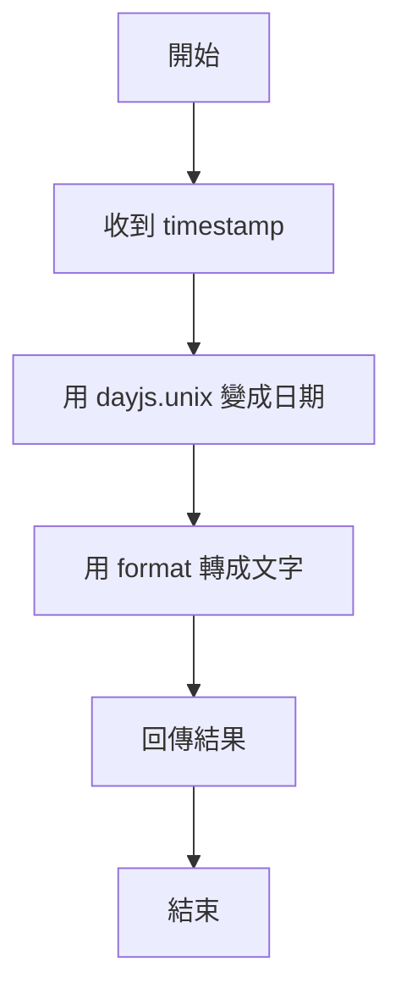

# 第七週作業預習 V2

這份版本只從 `homework.js` 本身的角度來看題目。你可以把它想成：
「我正在寫 `homework.js`，我需要知道每個函式要做什麼，還有常用指令怎麼跑。」

這個版本先只做題目一，讓你先確認風格是否好懂。

## 一、怎麼看這份作業

你現在可以先記住三件事：

1. `homework.js` 是主要作業檔案。
2. 你會直接在 `homework.js` 裡面寫函式。
3. 先用 `node homework.js` 看結果，再用 `npm test` 檢查答案對不對。

### 常用指令

```bash
npm install
```

安裝套件。第一次打開專案通常要先做這一步。

```bash
node homework.js
```

直接執行 `homework.js`。如果檔案裡有 `console.log()`，就會看到輸出。

```bash
npm test
```

執行測試，看看你寫的函式有沒有通過。

---

## 題目一：`formatOrderDate(timestamp)`

### 這題在做什麼

這個函式的工作很單純：

- 輸入一個時間數字 `timestamp`
- 把它轉成日期文字
- 回傳像 `2024/01/01 08:00` 這樣的字串

你可以先把它想成：

「我拿到一個時間，想把它變成比較好讀的格式。」

### 你在 `homework.js` 裡會怎麼寫

因為你就是在 `homework.js` 裡面寫，所以**不需要** `require('./homework.js')` 去載入自己。

你只要直接寫函式，然後在同一個檔案裡自己測試它。

### 重要觀念

- `timestamp` 是 Unix 時間，單位是「秒」
- Unix 時間可以先想成「從 1970/01/01 開始算過了多少秒」的數字
- 它本身不是日期文字，所以要先轉成日期，才看得懂
- 1 天 = 86400 秒
- 1 小時 = 3600 秒
- 1 分鐘 = 60 秒
- `dayjs.unix()` 可以把秒數變成日期
- `.format('YYYY/MM/DD HH:mm')` 可以把日期變成指定格式

### 計算範例

```js


// 10 天前 = 現在時間 - 10 天的秒數
const tenDaysAgo = now - 86400 * 10;

// 3 小時前 = 現在時間 - 3 小時的秒數
const threeHoursAgo = now - 3600 * 3;

// 5 分鐘前 = 現在時間 - 5 分鐘的秒數
const fiveMinutesAgo = now - 60 * 5;

// 現在時間（Unix 秒）
const now = Math.floor(Date.now() / 1000);
這一行可以拆開看：
```

- `Date.now()`：先拿到「現在時間」
- `Date.now()` 的結果是「毫秒」
- `/ 1000`：把毫秒換成秒
- `Math.floor(...)`：把小數去掉，只留下整數
- 最後得到的 `now`：就是「現在的 Unix 秒」

你也可以先把它想成：

```js
現在時間（毫秒） ÷ 1000 = 現在時間（秒）
```

再用 `Math.floor` 把小數去掉。

### 小例子

如果現在時間是：

```js
Date.now() = 1704067200123
```

那麼：

```js
1704067200123 / 1000 = 1704067200.123
Math.floor(1704067200.123) = 1704067200
```

所以：

```js
const now = Math.floor(Date.now() / 1000);
```

的意思就是：

「把現在時間轉成 Unix 秒，方便拿去做日期計算。」

你可以先把這些公式記成：

- 幾天前：`現在時間 - 86400 * 天數`
- 幾小時前：`現在時間 - 3600 * 小時數`
- 幾分鐘前：`現在時間 - 60 * 分鐘數`

### 逐步看懂程式

```js
function formatOrderDate(timestamp) {
  // 1. 拿到傳進來的時間數字
  // 2. 用 dayjs.unix() 把秒數轉成日期
  // 3. 用 format() 轉成字串
  // 4. 回傳結果
}
```

### 一個完整範例

```js
const dayjs = require('dayjs');

function formatOrderDate(timestamp) {
  const dateText = dayjs.unix(timestamp).format('YYYY/MM/DD HH:mm');
  return dateText;
}

console.log(formatOrderDate(1704067200));
```

### 這段程式在想什麼

1. `timestamp` 是一個數字。
2. `dayjs.unix(timestamp)` 把它變成日期。
3. `.format('YYYY/MM/DD HH:mm')` 把日期變成字串。
4. `return` 把結果送出去。

### 偽程式

```text
收到 timestamp
把 timestamp 變成日期
把日期轉成固定文字格式
把文字回傳
```

### 流程圖



### 互動練習題

請先想一想：

```js
function formatOrderDate(timestamp) {
  const dateText = dayjs.unix(timestamp).format('YYYY/MM/DD HH:mm');
  return dateText;
}
```

如果我傳入 `1704067200`，你覺得回傳結果會長什麼樣子？

你可以先只回答：

- 它會是一個數字？
- 還是一個文字？
- 還是日期格式的文字？

---

## 你確認完這題後，我再幫你做下一題

我下一步可以接著用同樣方式整理：

1. `getDaysAgo(timestamp)`
2. `isOrderOverdue(timestamp)`
3. `getThisWeekOrders(orders)`
4. `validateOrderUser(data)`
5. `validateCartQuantity(quantity)`
6. `generateOrderId()` / `generateCartItemId()`
7. `getProductsWithAxios()` / `addToCartWithAxios()` / `getOrdersWithAxios()`
8. `OrderService`

如果你覺得這個版本比較好懂，我就照這個格式繼續做下一題。
