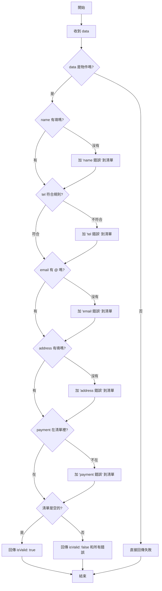
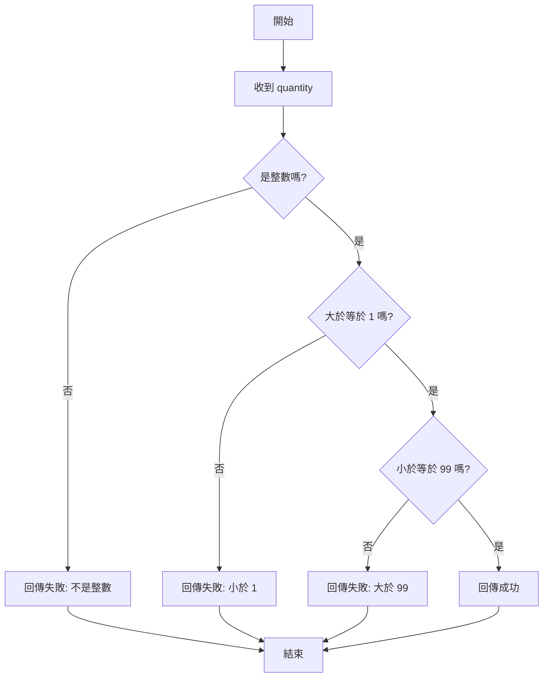

# 任務二：資料驗證

這份檔案教你怎麼驗證使用者資料和購物車數量。

---

## 題目一：`validateOrderUser(data)`

### 這題在做什麼

驗證客人填的資料對不對。

你會收到一個物件，裡面有：
- 名字 (name)
- 電話 (tel)
- 信箱 (email)
- 地址 (address)
- 付款方式 (payment)

然後你要檢查：

- 名字有沒有空？
- 電話是不是 09 開頭 10 位數字？
- 信箱有沒有 @ 符號？
- 地址有沒有空？
- 付款方式是不是允許的方式（ATM、Credit Card、Apple Pay）？

如果有錯誤，就列出所有錯誤。

### 重要觀念

#### 什麼是「物件」？

物件就像一個記事本，每一頁都有「欄位名」和「值」。

```js
const userData = {
  name: '王小明',      // 欄位：name，值：'王小明'
  tel: '0912345678',   // 欄位：tel，值：'0912345678'
  email: 'abc@example.com',  // 欄位：email，值：'abc@example.com'
  address: '台北市中正區',    // 欄位：address，值：'台北市中正區'
  payment: 'ATM'       // 欄位：payment，值：'ATM'
};
```

要拿到裡面的值，就用 `物件.欄位名`：

```js
userData.name    // '王小明'
userData.tel     // '0912345678'
userData.email   // 'abc@example.com'
```

#### 什麼是「正規表達式」（Regex）？

#### 什麼是 `.trim()`？

`.trim()` 是字串的方法（method），用來「去掉字串前後的空白」。

範例：

```js
const name1 = '  王小明  ';
name1.trim(); // '王小明'（前後空白被移除）

const empty = '   ';
empty.trim(); // ''（只剩空字串）
```

為什麼要用 `.trim()`？

- 使用者在表單輸入時，常常不小心在前後按到空白鍵；用 `.trim()` 可以避免「看起來有內容但其實全是空白」的情況。
- 在檢查是否為空字串時，常搭配 `String(...).trim() === ''` 來判斷。


正規表達式是一個「檢查規則」。

比如：`/^09\d{8}$/`

- `^09` ：開頭必須是 09
- `\d{8}` ：後面必須是 8 個數字（\d = digit）
- `$` ：結尾（不能有多的字）

你可以用 `.test()` 來檢查：

```js
const tel = '0912345678';
/^09\d{8}$/.test(tel);  // true，符合規則

const tel2 = '0812345678';
/^09\d{8}$/.test(tel2);  // false，不符合規則
```

#### 什麼是「陣列」和 `.includes()`？

陣列是一個「清單」，裡面有好幾個東西：

```js
const allowed = ['ATM', 'Credit Card', 'Apple Pay'];
```

要檢查清單裡有沒有某個東西，用 `.includes()`：

```js
allowed.includes('ATM');          // true
allowed.includes('Bitcoin');      // false
```

#### 什麼是「回傳物件」？

這個函式不只回傳「對或不對」，還要回傳「哪裡錯了」。

所以回傳的是一個物件：

```js
{ isValid: true, errors: [] }    // 通過，沒有錯誤

{ isValid: false, errors: ['name 不可為空', 'tel 格式錯誤'] }  // 失敗，有 2 個錯誤
```

#### 什麼是「否定運算子」（!data）？

`!` 是**否定運算子**（NOT operator），它把「真」變成「假」，把「假」變成「真」。

在 JavaScript 裡，有一些值被認為是「假的」（falsy）：

```js
null           // 假的
undefined      // 假的
0              // 假的
''             // 空文字，假的
false          // 假的
NaN            // 假的
```

其他都是「真的」（truthy）。

所以 `!data` 是在問：**「data 是不是『假的值』？」**

```js
const data1 = null;
!data1  // true（因為 null 是假的）

const data2 = undefined;
!data2  // true（因為 undefined 是假的）

const data3 = { name: 'abc' };
!data3  // false（因為物件是真的）
```

在檢查資料時很有用：

```js
if (!data || typeof data !== 'object') {
  // 如果 data 是 null、undefined，或者不是物件，就進來這裡
  return { isValid: false, errors: ['資料格式不正確'] };
}
```

這樣做是為了避免程式出錯。如果直接用 `data.name` 但 `data` 是 `null`，程式會壞掉。

### 逐步看懂程式

```js
function validateOrderUser(data) {
  // 第 1 步：建立一個空清單，放要回報的錯誤
  const errors = [];

  // 第 2 步：檢查資料對不對是「物件」
  if (!data || typeof data !== 'object') {
    return { isValid: false, errors: ['資料格式不正確'] };
  }

  // 第 3 步：逐個檢查每個欄位
  if (!data.name || String(data.name).trim() === '') {
    errors.push('name 不可為空');
  }

  if (!data.tel || !/^09\d{8}$/.test(String(data.tel))) {
    errors.push('tel 格式錯誤，應為 09 開頭的 10 位數字');
  }

  if (!data.email || !String(data.email).includes('@')) {
    errors.push('email 必須包含 @');
  }

  if (!data.address || String(data.address).trim() === '') {
    errors.push('address 不可為空');
  }

  // 第 4 步：檢查付款方式
  const allowed = ['ATM', 'Credit Card', 'Apple Pay'];
  if (!allowed.includes(data.payment)) {
    errors.push('payment 非允許的付款方式');
  }

  // 第 5 步：回傳結果
  // 如果 errors 陣列是空的，代表沒有錯誤；否則有錯誤
  return { isValid: errors.length === 0, errors };
}
```

### 拆解說明

**第 1 步：建立空清單**

```js
const errors = [];
```

- `errors` 是一個陣列
- 當有錯誤時，用 `.push()` 加進去

**第 2 步：檢查資料格式**

```js
if (!data || typeof data !== 'object') {
  return { isValid: false, errors: ['資料格式不正確'] };
}
```

  - `!data`：檢查 `data` 是否存在（請參考上方「否定運算子」說明）
  - `typeof data !== 'object'` ：檢查它是不是物件
  - 如果都不是物件，直接回傳「失敗」，後面不用檢查

**第 3 步到第 6 步：逐個檢查欄位**

以 `name` 為例：

```js
if (!data.name || String(data.name).trim() === '') {
  errors.push('name 不可為空');
}
```

拆開讀：
1. `!data.name` ：name 是不是沒有被填（undefined 或 null）？
2. `String(data.name).trim() === ''` ：把 name 變成文字，去掉前後空白，是不是空的？
3. 如果上面任何一個是真的，就把「name 不可為空」加到 errors 清單

以 `tel` 為例：

```js
if (!data.tel || !/^09\d{8}$/.test(String(data.tel))) {
  errors.push('tel 格式錯誤，應為 09 開頭的 10 位數字');
}
```

拆開讀：
1. `!data.tel` ：tel 是不是沒有被填？
2. `!/^09\d{8}$/.test(...)` ：不符合「09 開頭、8 個數字」的規則？
3. 如果任何一個是真的，就把錯誤加到清單

**第 7 步：回傳結果**

```js
return { isValid: errors.length === 0, errors };
```

- `errors.length === 0` ：如果清單是空的（沒有錯誤），就是 true
- 否則就是 false
- 回傳「是否通過」和「錯誤清單」

### 偽程式

```text
1. 建立空的錯誤清單

2. 檢查資料是不是物件
   ⤷ 不是的話，直接回傳「失敗」

3. 檢查 name
   ⤷ 空的話，加「name 不可為空」到清單

4. 檢查 tel
   ⤷ 不是「09 + 8 個數字」，加錯誤到清單

5. 檢查 email
   ⤷ 沒有 @，加錯誤到清單

6. 檢查 address
   ⤷ 空的話，加錯誤到清單

7. 檢查 payment
   ⤷ 不在允許清單裡，加錯誤到清單

8. 如果清單是空的，回傳「成功」
   否則回傳「失敗」和所有錯誤
```

### 流程圖



### 互動練習

**練習 1**

```js
const result = validateOrderUser({
  name: '王小明',
  tel: '0912345678',
  email: 'abc@example.com',
  address: '台北市',
  payment: 'ATM'
});
```

你覺得 `result` 會是什麼？

- A. `{ isValid: true, errors: [] }`
- B. `{ isValid: false, errors: ['tel 格式錯誤'] }`
- C. `{ isValid: false, errors: [] }`

**練習 2**

```js
const result = validateOrderUser({
  name: '',
  tel: '123456789',
  email: 'abc@example.com',
  address: '台北市',
  payment: 'Bitcoin'
});
```

你覺得會有幾個錯誤？

- A. 1 個
- B. 2 個
- C. 3 個

---

## 題目二：`validateCartQuantity(quantity)`

### 這題在做什麼

驗證買東西的數量合不合理。

你會收到一個數字，檢查：

- 是不是整數（不能有小數）？
- 是不是至少 1（不能是 0 或負數）？
- 是不是最多 99（不能一次買太多）？

如果有任何問題，回傳錯誤訊息。

### 重要觀念

#### 什麼是「整數」？

整數是沒有小數點的數字。

```js
1, 2, 100          // 整數
1.5, 2.3, 3.14    // 不是整數（有小數）
```

用 `Number.isInteger()` 來檢查：

```js
Number.isInteger(5);      // true
Number.isInteger(5.5);    // false
Number.isInteger('5');    // false（這是文字，不是數字）
```

#### 什麼是「比較運算子」？

```js
5 > 3      // true（5 大於 3）
5 >= 5     // true（5 大於或等於 5）
5 < 3      // false（5 不小於 3）
5 <= 3     // false（5 不小於等於 3）
5 === 5    // true（相等）
5 !== 3    // true（不相等）
```

### 逐步看懂程式

```js
function validateCartQuantity(quantity) {
  // 第 1 步：檢查是不是整數
  const isInteger = Number.isInteger(quantity);
  if (!isInteger) return { isValid: false, error: '數量必須為整數' };

  // 第 2 步：檢查是不是小於 1
  if (quantity < 1) return { isValid: false, error: '數量不可小於 1' };

  // 第 3 步：檢查是不是大於 99
  if (quantity > 99) return { isValid: false, error: '數量不可大於 99' };

  // 第 4 步：都符合，回傳成功
  return { isValid: true };
}
```

### 拆解說明

**第 1 步：檢查整數**

```js
const isInteger = Number.isInteger(quantity);
if (!isInteger) return { isValid: false, error: '數量必須為整數' };
```

- 用 `Number.isInteger()` 檢查是不是整數
- 如果不是，馬上回傳「失敗」和錯誤訊息
- 如果是，繼續檢查

**第 2 步：檢查最小值**

```js
if (quantity < 1) return { isValid: false, error: '數量不可小於 1' };
```

- 如果 `quantity < 1`（小於 1），回傳失敗
- 否則繼續

**第 3 步：檢查最大值**

```js
if (quantity > 99) return { isValid: false, error: '數量不可大於 99' };
```

- 如果 `quantity > 99`（大於 99），回傳失敗
- 否則繼續

**第 4 步：都符合**

```js
return { isValid: true };
```

- 三個檢查都通過，回傳「成功」
- 注意：沒有 `error` 欄位（因為沒有錯誤）

### 偽程式

```text
1. 檢查是不是整數
   ⤷ 不是，回傳「失敗，數量必須為整數」

2. 檢查是不是小於 1
   ⤷ 是，回傳「失敗，數量不可小於 1」

3. 檢查是不是大於 99
   ⤷ 是，回傳「失敗，數量不可大於 99」

4. 都符合，回傳「成功」
```

### 流程圖



### 互動練習

**練習 1**

```js
validateCartQuantity(5)
```

回傳什麼？

**練習 2**

```js
validateCartQuantity(0)
```

回傳什麼？

**練習 3**

```js
validateCartQuantity(100)
```

回傳什麼？

**練習 4**

```js
validateCartQuantity(5.5)
```

回傳什麼？

---

## 你確認完這題後，我再幫你做下一題

如果這個格式好懂，下一題可以做：

1. `getDaysAgo(timestamp)` / `isOrderOverdue(timestamp)` / `getThisWeekOrders(orders)`
2. `generateOrderId()` / `generateCartItemId()`
3. `getProductsWithAxios()` / `addToCartWithAxios()` / `getOrdersWithAxios()`
4. `OrderService`

讓我知道這份教材是否清楚，以及要先做哪一題。
