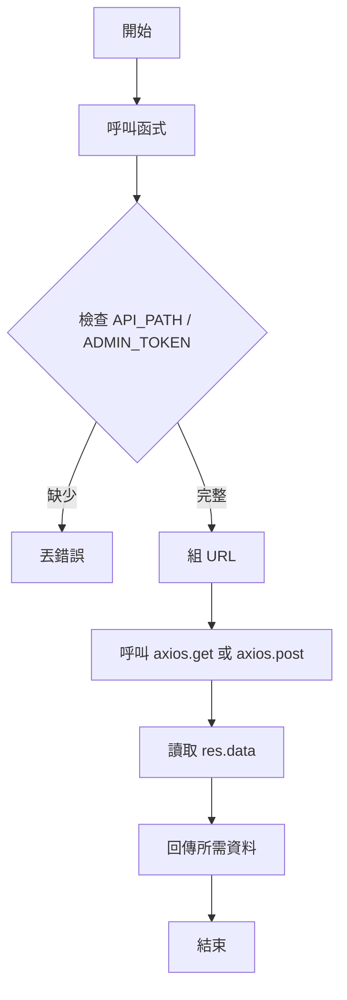

# 任務四：Axios 串接（API 請求）

這份說明以 `homework.js` 的解題方式，示範如何用 `axios` 實作三個函式：

- `getProductsWithAxios()`：取得商品列表
- `addToCartWithAxios(productId, quantity)`：加入購物車
- `getOrdersWithAxios()`：取得後台訂單（需管理員權限）

---

## 這題在做什麼

你要把前端（或測試）需要的資料，透過 HTTP 請求向後端 API 取得或送出。

- `GET` 用來抓資料（例如商品、訂單）
- `POST` 用來送資料（例如新增購物車項目）

`axios` 是一個常用的 HTTP 客戶端，語法簡單、支援 promise/async-await。

### 重要觀念

- `BASE_URL`：API 的主機，例如 `https://livejs-api.hexschool.io`。
- `API_PATH`：你的專案路徑（從 `.env` 讀取），請求會去 `${BASE_URL}/api/${API_PATH}/...`。
- `ADMIN_TOKEN`：管理員權杖（從 `.env` 讀取），用於有權限的後台路由。
- `axios.get(url)`：發 GET 請求，回傳 response 物件，實際資料在 `response.data`。
- `axios.post(url, body)`：發 POST 請求，第二個參數是 request body。
- `headers`：需要授權時把 `authorization` 放在 headers 裡面。
- 錯誤處理：遇到 API_PATH 或權杖沒設定時，主動丟錯誤（throw new Error），方便測試與除錯。

---

## 逐步看懂程式

以下為簡潔、實作級的範例（與 `homework-ai.js` 相同思路）：

```js
async function getProductsWithAxios() {
  if (!API_PATH) throw new Error('API_PATH 未設定');
  const url = `${BASE_URL}/api/${API_PATH}/products`;
  const res = await axios.get(url);
  // res.data 可能是 { products: [...] }
  return res.data && res.data.products ? res.data.products : [];
}

async function addToCartWithAxios(productId, quantity) {
  if (!API_PATH) throw new Error('API_PATH 未設定');
  const url = `${BASE_URL}/api/${API_PATH}/cart`;
  const data = { data: { productId, quantity } }; // API 規格要求的格式
  const res = await axios.post(url, data);
  return res.data; // 回傳整個 API 回應（方便測試或顯示訊息）
}

async function getOrdersWithAxios() {
  if (!API_PATH || !ADMIN_TOKEN) throw new Error('API_PATH 或 API_KEY 未設定');
  const url = `${BASE_URL}/api/${API_PATH}/admin/orders`;
  const res = await axios.get(url, { headers: { authorization: ADMIN_TOKEN } });
  return res.data && res.data.orders ? res.data.orders : [];
}
```

### 每一步拆解

1. **檢查環境變數**：如果 `API_PATH` 或 `ADMIN_TOKEN` 沒設定，直接丟錯誤，避免發不必要的請求。
2. **組好 URL**：把 `BASE_URL`、`API_PATH` 與路徑（`products`、`cart`、`admin/orders`）拼接。
3. **呼叫 axios**：`axios.get(url)` 或 `axios.post(url, data)`。
4. **讀取 response**：主要資料通常在 `res.data`，再依照 API 回傳格式拿想要欄位（例如 `res.data.products`）。
5. **回傳乾淨資料**：如果沒有資料，回傳空陣列 `[]` 或回傳 `res.data`（視函式目的而定）。

---

## 偽程式

```text
getProductsWithAxios:
  1. 如果 API_PATH 未設定，丟錯
  2. 組 url = BASE_URL + /api/ + API_PATH + /products
  3. await axios.get(url)
  4. 回傳 res.data.products 或 []

addToCartWithAxios:
  1. 如果 API_PATH 未設定，丟錯
  2. 組 url = BASE_URL + /api/ + API_PATH + /cart
  3. data = { data: { productId, quantity }}
  4. await axios.post(url, data)
  5. 回傳 res.data

getOrdersWithAxios:
  1. 如果 API_PATH 或 ADMIN_TOKEN 未設定，丟錯
  2. 組 url = BASE_URL + /api/ + API_PATH + /admin/orders
  3. await axios.get(url, { headers: { authorization: ADMIN_TOKEN }})
  4. 回傳 res.data.orders 或 []
```

---

## 流程圖



---

## 範例輸出（假設 API 回傳正常）

```js
await getProductsWithAxios(); // => [ { id: 'p1', title: '商品 A', ... }, ... ]
await addToCartWithAxios('p1', 2); // => { success: true, cart: { ... } }
await getOrdersWithAxios(); // => [ { id: 'o1', createdAt: 1704..., ... }, ... ]
```

---

如需我把錯誤處理加得更詳細（例如捕捉 axios 錯誤並回傳可讀訊息），或把這些函式直接加入 `homework.js`，告訴我下一步。