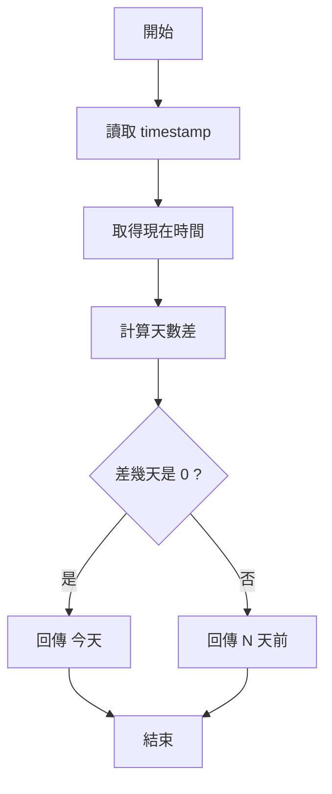
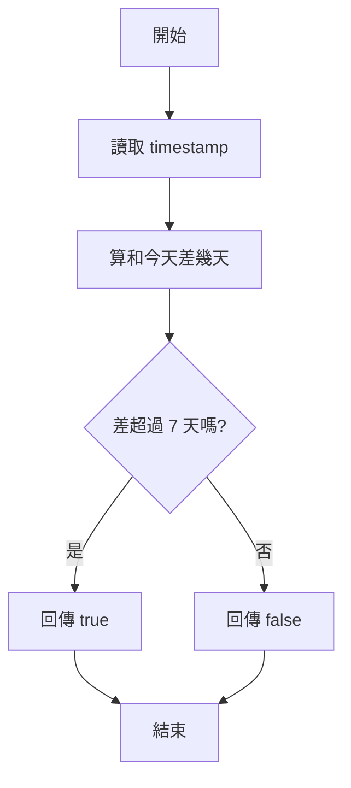
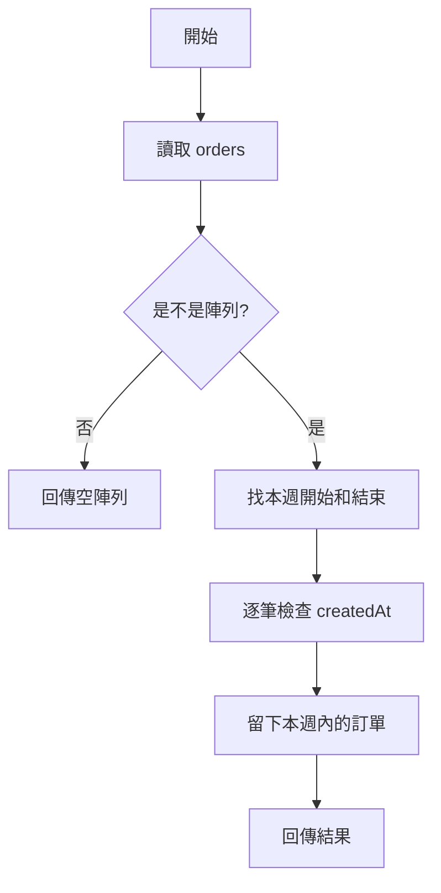
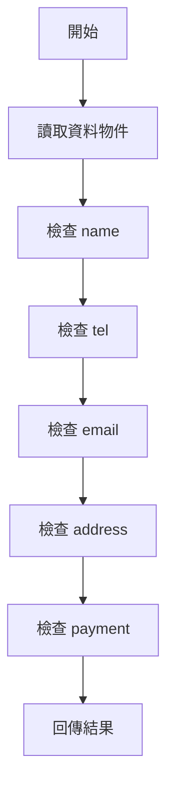
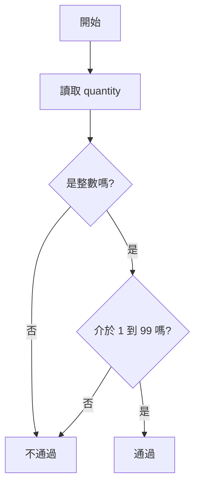
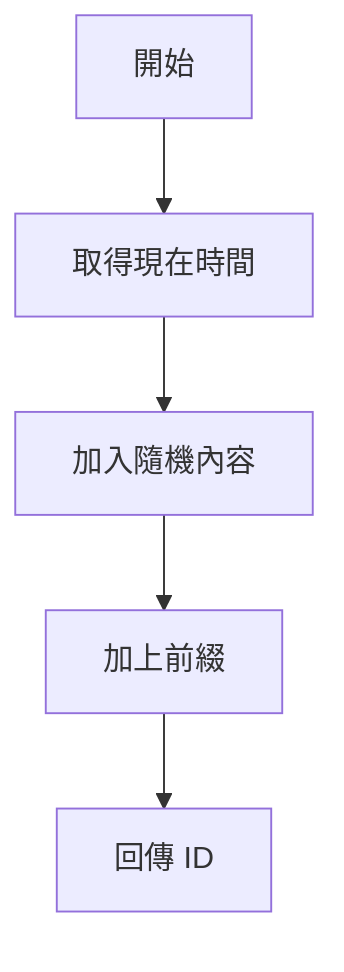
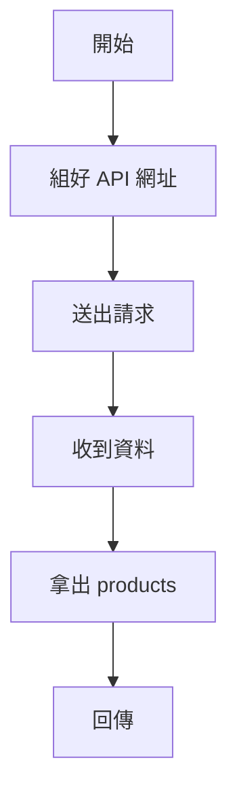
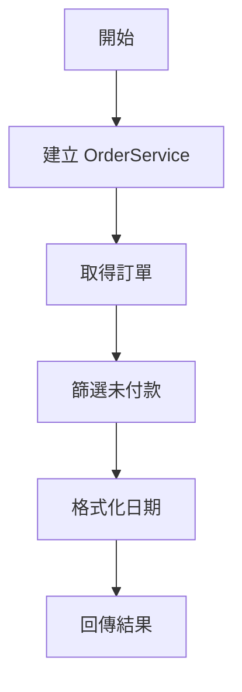

# 第七週作業 — 預習說明（草稿）

這份檔案為預習用說明，包含作業目標、所需函式與操作指令，方便在開始實作前先熟悉題目與驗證方式。

## 一、作業背景與學習目標
- 學習整合第三方套件：`dayjs`（處理日期）與 `axios`（API 串接）。
- 練習資料驗證、唯一識別碼產生與陣列篩選等實作技巧。
- 結合上述功能組成簡單的訂單服務（OrderService）。

## 二、快速上手
1. 安裝相依套件：

```bash
npm install
```

2. 設定環境變數（在專案根目錄建立 `.env`，若要測試 API 串接需填寫）

```
API_PATH=your-api-path
API_KEY=your-admin-token
```

3. 執行程式（列印簡單測試訊息）：

```bash
node homework.js
```

4. 執行自動化測試（Jest）：

```bash
npm test
```

> 備註：若 `.env` 未設定 `API_PATH`/`API_KEY`，與 API 串接相關的測試會要求您先填入環境變數。

## 三、作業要完成的主要函式（摘要）

-- `formatOrderDate(timestamp)`（初學者預習）
  - 目的：把 Unix 時間戳（單位為「秒」）轉成「可讀的日期字串」。
  - 指令 / 呼叫：在終端執行 `node homework.js` 或在小程式中：

```js
const hw = require('./homework.js');
console.log(hw.formatOrderDate(1704067200)); // 範例輸出: '2024/01/01 08:00'
```
  - 要點：傳入的是「秒」，不是毫秒（不要把 Date.now() 的數字直接帶入）。常見錯誤：傳入字串 `'1704...'` 時需要轉型 `Number()`。

=== 範例題目（示範一題） ===

題目一：`formatOrderDate(timestamp)` — 逐步教學（示範一題）

- 一句話說明：把 `timestamp`（秒）轉成「YYYY/MM/DD HH:mm」的字串。

- 逐行註解的程式範例（可直接在 Node.js 中執行）：

```js
// 載入 dayjs（在專案中已安裝）
const dayjs = require('dayjs');

function formatOrderDate(timestamp) {
  // 1. 如果沒有輸入，回傳空字串（避免錯誤）
  if (timestamp == null) return '';

  // 2. 確保輸入是數字（有時會收到字串）
  const t = Number(timestamp);

  // 3. 用 dayjs 將 Unix 秒轉成日期，並格式化成指定字串
  const text = dayjs.unix(t).format('YYYY/MM/DD HH:mm');

  // 4. 回傳格式化後的字串
  return text;
}

// 範例呼叫
console.log(formatOrderDate(1704067200)); // '2024/01/01 08:00'
```

- 偽程式（把邏輯拆成簡短步驟，利於閱讀）

```
輸入 timestamp
如果 timestamp 空 -> 回傳 空字串
把 timestamp 轉成數字 t
用 dayjs.unix(t) 轉成日期物件
格式化成 'YYYY/MM/DD HH:mm'
回傳格式化字串
```

- 流程圖（Mermaid）：

```mermaid
graph TD
  A[開始] --> B{有輸入 timestamp 嗎?}
  B -- 否 --> C[回傳 空字串]
  B -- 是 --> D[轉成數字 t]
  D --> E[dayjs.unix(t) 取得日期]
  E --> F[格式化為 'YYYY/MM/DD HH:mm']
  F --> G[回傳字串]
  G --> H[結束]
```

- 互動式練習題（請您回答或在本地試做）：

1) 請填空（把下列步驟用程式碼實作）

```js
// 填空：把 timestamp 轉成數字
const t = /* ??? */;

// 填空：用 dayjs 轉換並格式化
const text = /* ??? */;

return text;
```

2) 我會等待您填完或回答 `t` 和 `text` 應該是什麼（只要短答），然後我再把下一題改成同樣格式。 

----

-- `getDaysAgo(timestamp)`（初學者預習）
  - 一句話說明：把某個時間點和今天比較，說出「今天」或「幾天前」。

```js
const hw = require('./homework.js');

console.log(hw.getDaysAgo(Math.floor(Date.now() / 1000))); // 今天
```

```js
function getDaysAgo(timestamp) {
  // 1. 取得現在
  // 2. 取得傳進來的時間
  // 3. 算兩者差幾天
  // 4. 如果差 0 天，就回傳「今天」
  // 5. 其他情況就回傳「N 天前」
}
```



1) 互動練習：如果現在是今天，`getDaysAgo` 應該回傳什麼？

```js
// 請把空格補上
console.log(hw.getDaysAgo(/* ??? */));
```

-- `isOrderOverdue(timestamp)`（初學者預習）
  - 一句話說明：判斷一筆訂單是不是超過 7 天。

```js
const hw = require('./homework.js');

console.log(hw.isOrderOverdue(Math.floor(Date.now() / 1000) - 86400 * 10)); // true
```

```js
function isOrderOverdue(timestamp) {
  // 1. 取得現在
  // 2. 取得訂單時間
  // 3. 算相差幾天
  // 4. 大於 7 天就回傳 true
  // 5. 否則回傳 false
}
```



1) 互動練習：如果訂單是 10 天前，回傳 true 還是 false？

```js
console.log(hw.isOrderOverdue(Math.floor(Date.now() / 1000) - 86400 * 10));
```

-- `getThisWeekOrders(orders)`（初學者預習）
  - 一句話說明：從很多訂單裡面，挑出本週的訂單。

```js
const hw = require('./homework.js');

const orders = [
  { id: 'a', createdAt: 1680000000 },
  { id: 'b', createdAt: 1680600000 }
];

const thisWeek = hw.getThisWeekOrders(orders);
console.log(thisWeek);
```

```js
function getThisWeekOrders(orders) {
  // 1. 先確認是不是陣列
  // 2. 找出本週開始
  // 3. 找出本週結束
  // 4. 一筆一筆檢查 createdAt
  // 5. 把符合的訂單留下來
}
```



1) 互動練習：如果 `orders` 裡有 3 筆資料，只有 1 筆在本週，結果會有幾筆？

```js
console.log(hw.getThisWeekOrders(orders).length);
```

-- `validateOrderUser(data)`（初學者預習）
  - 一句話說明：檢查使用者資料有沒有填對。

```js
const hw = require('./homework.js');

const user = {
  name: '王小明',
  tel: '0912345678',
  email: 'a@b.com',
  address: '台北',
  payment: 'Credit Card'
};

console.log(hw.validateOrderUser(user));
```

```js
function validateOrderUser(data) {
  // 1. 看 name 有沒有填
  // 2. 看 tel 格式對不對
  // 3. 看 email 有沒有 @
  // 4. 看 address 有沒有填
  // 5. 看 payment 是不是允許的值
  // 6. 回傳是否通過
}
```



1) 互動練習：如果 `name` 是空字串，應該通過還是不通過？

```js
console.log(hw.validateOrderUser({ name: '', tel: '0912345678', email: 'a@b.com', address: '台北', payment: 'Credit Card' }));
```

-- `validateCartQuantity(quantity)`（初學者預習）
  - 一句話說明：確認購物車數量是合理的整數。

```js
const hw = require('./homework.js');

console.log(hw.validateCartQuantity(5));
console.log(hw.validateCartQuantity(5.5));
```

```js
function validateCartQuantity(quantity) {
  // 1. 檢查是不是整數
  // 2. 檢查有沒有小於 1
  // 3. 檢查有沒有大於 99
  // 4. 都沒問題就通過
}
```



1) 互動練習：`0`、`5`、`100` 哪一個會通過？

```js
console.log(hw.validateCartQuantity(5));
```

-- `generateOrderId()` / `generateCartItemId()`（初學者預習）
  - 一句話說明：做出一個看起來不會重複的編號。

```js
const hw = require('./homework.js');

console.log(hw.generateOrderId());
console.log(hw.generateCartItemId());
```

```js
function generateOrderId() {
  // 1. 取得現在時間
  // 2. 再加上一點隨機內容
  // 3. 前面加上 ORD-
  // 4. 回傳字串
}
```



1) 互動練習：為什麼每次執行結果會不一樣？

```js
console.log(hw.generateOrderId());
```

-- `getProductsWithAxios()` / `addToCartWithAxios(productId, quantity)` / `getOrdersWithAxios()`（初學者預習）
  - 一句話說明：跟網站拿資料，或把資料送出去。

```js
const hw = require('./homework.js');

async function main() {
  const products = await hw.getProductsWithAxios();
  console.log(products);
}

main();
```

```js
function getProductsWithAxios() {
  // 1. 組好網址
  // 2. 用 axios 送出請求
  // 3. 取出 products
  // 4. 回傳結果
}
```



1) 互動練習：如果要先拿資料，再印出長度，哪個關鍵字一定要加？

```js
// 請試著補上
async function main() {
  const products = await hw.getProductsWithAxios();
  console.log(products.length);
}
```

-- `OrderService`（物件，初學者預習）
  - 一句話說明：把幾個相關功能包在一起，方便一起使用。

```js
const hw = require('./homework.js');

async function main() {
  const result = await hw.OrderService.getUnpaidOrdersFormatted();
  console.log(result);
}

main();
```

```js
const OrderService = {
  // 1. 取得訂單
  // 2. 格式化日期
  // 3. 篩選未付款
  // 4. 把功能包在一起
};
```



1) 互動練習：如果要一次做完「拿訂單 + 篩未付款 + 格式化」，你覺得應該放在哪裡？

```js
console.log(hw.OrderService);
```


### 基礎知識速查（給完全初學者）
- 陣列（Array）：用 `[]` 表示，取用 `arr[0]`，遍歷常用 `for`、`forEach`、`map`、`filter`。
- 物件（Object）：用 `{}` 表示，取用 `obj.key` 或 `obj['key']`。
- 函式（Function）：用 `function name(params) {}` 或 `const fn = (p)=>{}`，`return` 結果。
- 加減乘除：`+ - * /`，注意字串與數字相加會產生串接（`'1' + 2 === '12'`）。
- 比較：使用 `===`（嚴格相等）比 `==` 更安全。
- 非同步：`async/await` 用於等待 Promise 結果，必須在 `async` 函式內使用。

### 常見錯誤總結
- 傳錯時間單位：Unix 秒 vs 毫秒。
- 對陣列或物件直接使用數字方法（例如對 `undefined` 呼叫 `.filter()`）。
- 忘記把輸入從字串轉數字（`'5'` vs `5`）。
- 忘記 `await` 或不捕捉網路錯誤。

（以下章節保留原內容）

## 四、如何在本地測試與驗證

1. 先執行 `npm install` 安裝套件。

2. 先跑單一檔案的執行檢視輸出：

```bash
node homework.js
```

會列印一些測試結果（在 `if (require.main === module)` 區塊），方便快速檢查實作狀態。

3. 使用 Jest 執行整套測試：

```bash
npm test
```

若測試失敗，Jest 會指出哪個函式或哪個測試案例未通過。常見修正流程：
- 讀取測試檔 `test.js` 中的該案例（可以看到輸入與預期行為），
- 回到 `homework.js` 對應函式修正，
- 再次執行 `npm test`。

## 五、範例：在 Node REPL 或小程式中呼叫

可以在 Node REPL 或一個短小的檔案中測試函式：

```js
const hw = require('./homework.js');
console.log(hw.formatOrderDate(1704067200));
console.log(hw.getDaysAgo(Math.floor(Date.now()/1000)));
console.log(hw.isOrderOverdue(Math.floor(Date.now()/1000) - 86400 * 10));
```

## 六、開發建議
- 先完成「任務一：日期處理」，確保 `formatOrderDate`、`getDaysAgo`、`isOrderOverdue` 通過測試；
- 再實作「任務二：資料驗證」，因為其他功能會使用驗證結果；
- 若不想馬上串接實際 API，可先用假資料（mock）或跳過與 API 有關的測試；
- 每次修改後先執行相關單元測試（可用 `jest -t <name>` 篩選測試）。

---

如果您同意，我可以：
1. 把這份草稿合併到 `README.md`，或
2. 保留為 `PREVIEW.md` 供您預覽（目前已新增在專案根目錄）。

接下來我可以繼續：實作更多函式、修正錯誤，並執行 `npm test` 驗證結果。請告訴我您要我做哪一項。 
